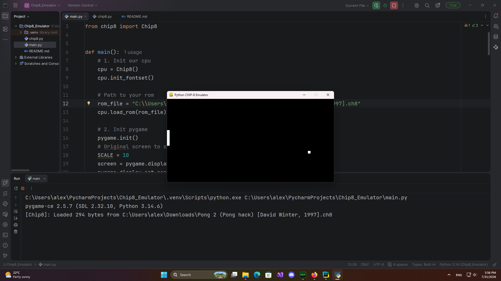

## CHIP-8 EMULATOR 

This emulator a standard chip-8 cpu not chip-8 super

## What can it run

It can run most of .ch8 games and programs 

## ROMS

You can find roms in this repo

- [CHIP-8 ROMs by kripod](https://github.com/kripod/chip8-roms) - Test ROMs and games

## Status
- Basic implementation. May have performance issues with some ROMs.
- Works with Pong and basic games.

## Issues 
- Some games are not working correctly or just don't starting
- Sound not implemented
   
## Usage
```bash
  git clone https://github.com/CBSDF/Chip8-Emulator.git
  cd Chip8-Emulator
  pip install pygame
  python main.py 
```
- Enter path to rom in main.py
## IF PYGAME NOT INSTALLING

run this command
```bash
  pip install pygame-ce
```
## SCREENSHOTS



*Running Pong (David Winter, 1997)*

## CHANGELOG
- improved font
- updated rendering

## Why did i create it?

This was my first learning project to understand how the emulators work on the  inside
I started with the  basics like processor cycles, work with memory, fetch opcodes, and rendering graphics

## Who is it for?

For begginers from small regions in Russia and other countries. 
It was also created to show that even if you want to learn computer science
but don't have access to specialized schools, you can still learn it
from open-source projects and websites.

## A small step forward a bigger goal

As i said, this project was also created to understand the basics.
My next big project will be an emulator of the Apollo Guidance Computer (AGC) -
and i want to run the original NASA programs on it.


